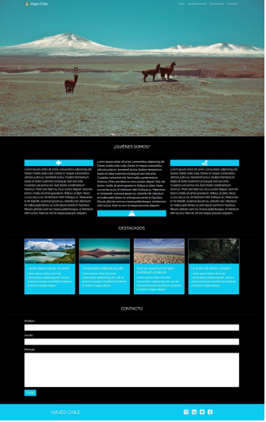

# Viajes Chile - Prueba
Trabajo  final del modulo 2 Fundamentos de desarrollo FRONT-END.

## Requisitos del proyecto
1. Construir la estructura de la página usando HTML.
2. Componer visualmente el documento HTML con propiedades de estilo CSS.
3. Emplear elementos de Bootstrap en el documento HTML.
4. Agregar componentes que utilicen JavaScript.
5. Gestionar el código fuente de la página utilizando GitHub.

## Capítulos que entraron en el proyecto

    . Introducción a HTML.
    . Crear páginas web con HTML.
    . Introducción a CSS.
    . Añadiendo CSS al proyecto.
    . Introducción a Bootstrap.
    . Integrando Bootstrap.
    . Usando Bootstrap para personalizar el proyecto.
    . Introducción a JavaScript.
    . Operaciones con JavaScript.
    . Integrando jQuery.
    . Bootstrap y JS.
    . Terminal y manejo de archivos.
    . Integrando Git.
    . Introducción a GitHub.
    . Trabajando con Git y GitHub.

#

## Descripción del proyecto

la agencia de Viajes Chile solicita la creación de su leading page, que tenga un diseño atractivo e innovador, utilizando los conocimientos que has adquirido a través de las distintas unidades.
 
Para esto, puedes guiarte de la siguiente estructura:

#

 
La página debe contener las siguientes secciones:

    . Barra de navegación fija a la parte superior, con logo y links a las distintas secciones de la página haciendo un Smooth scroll.

    . Carousel que muestre las imágenes destacadas del sitio.

    . Una sección de presentación, utilizando favicons y 3 párrafos (debe desaparecer en tamaños pequeños de la pantalla).

    . Una sección de destacados, que muestre 4 cards con la imagen e información asociada.

    . Una sección de formulario de contacto.

    . Una sección footer con link a las redes sociales.

#
## Acceso a la página

<a href="https://perrolocomc.github.io/prueba_viajes_chile/" target="_blank">Visita mi proyecto en Git Hub</a>
 

## Recursos utilizados

<a href="https://code.visualstudio.com/" target="_blank">Visual Studio Code</a>
   : Utilizado para el desarrollo completo del proyecto.

<a href="https://getbootstrap.com/docs/5.1/getting-started/introduction/" target="_blank">Bootstrap</a>
   : Utilizado para el diseño general del proyecto.

<a href="https://fonts.google.com/" target="_blank">Google Fonts</a>
   : utilizada para el diseño de las fuentes del proyecto.

<a href="https://fontawesome.com/" target="_blank">Font Awesome</a>
   : utilizada para insertar iconos al proyecto.

Se utilizo una hoja de estilos CSS propia para modificar algunos aspectos visuales del proyecto, también se agregó CDN de jQuery y script propios para el cumplimiento de las funcionalidades del proyecto.

# Características del proyecto

el proyecto se realizó con el objetivo de dejar registro de cada una de las secciones que se han desarrollado en el proyecto, así el usuario podrá acceder a ellas en cualquier momento y modificarlas si así lo desea.

# secciones del proyecto

1- Barra de navegación transparente y fija a la parte superior, con su respectivo logo y link a cada una de las secciones.

2- Carrusel con hermosas imágenes destacadas.

3- Sección de ¿Quiénes Somos? con una descripción de las actividades que realiza la agencia.

4- sección destacados con 4 cards con la información de cada uno de los destacados.

5- Sección de contacto con formulario donde el usuario podrá enviar un mensaje a la agencia.

6- Sección de footer con links a redes sociales.

## Proyecto creado por
Diego Aron Reyes Pallacan.

con ayuda del material de apoyo y estudio otorgado por Edutecno

## Agradecimientos
Al equipo docente de Edutecno Adrián Franco y Miguel Parra por el apoyo, paciencia y dedicación.

A las y los compañeros por las dudas resueltas.

A mi familia que siempre encuentran mis trabajos muy lindos.

